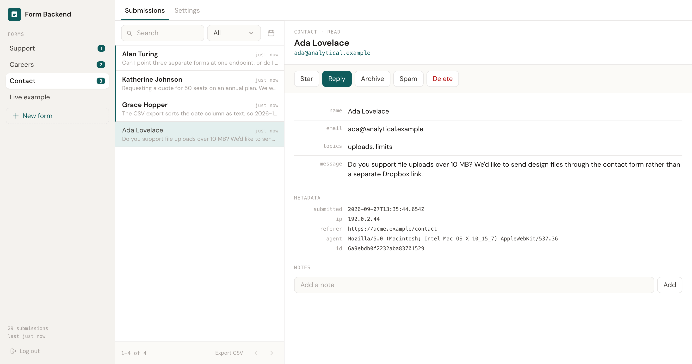
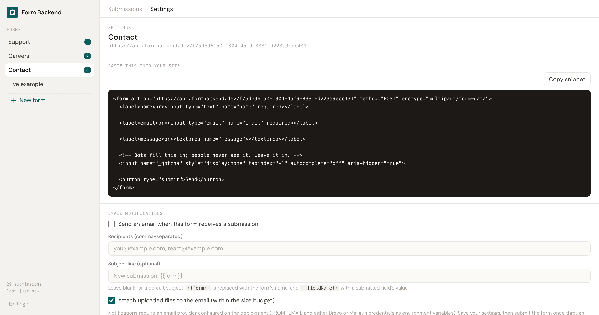

# Form Backend

A headless form backend on [Codehooks.io](https://codehooks.io). Point any HTML form at it and the
submissions land in your own database — with validation, file uploads, a domain allowlist, a
submission inbox API and CSV export.

No JavaScript is required on the page. It is the same job as Formspree, Getform or Basin, except you
host it and own the data.

**Live example:** [demo.formbackend.dev](https://demo.formbackend.dev) posts cross-origin to a real
deployment. Its source is in [`example/`](example/).

## Features

- **One endpoint per form** — `POST /f/:formId`, from an ordinary `<form action="...">`.
- **Three request shapes** — JSON, urlencoded, and multipart with file uploads. Binary files
  round-trip byte-identical.
- **Content-negotiated replies** — a JSON request gets `{"ok":true,"id":"..."}`; a browser form post
  gets a `302` to your `redirectUrl` or a hosted thank-you page.
- **Optional typed validation** — a form with no schema accepts anything, so an existing form works
  unchanged. Define fields and the server enforces types, `required`, `min`/`max` and `options`.
- **Domain allowlist** — checked server-side against `Origin`/`Referer` before anything is stored.
- **File uploads** — stored in the Codehooks filestore, served only to an authenticated admin.
- **Submission inbox API** — list, paginate, full-text search, filter by status and date, mark
  read/archived, star, add notes, delete (which also removes the files).
- **CSV export** — with spreadsheet formula injection neutralised.
- **Admin auth** — password login issuing an HttpOnly, Secure, SameSite=Strict JWT cookie.

- **Email notifications** — an owner gets emailed on submission, with the file attached (within a
  size budget) and a signed download link. Retried automatically on a transient provider failure.
- **An admin dashboard** — `/setup/` is a three-pane inbox: every form with its unread count, a
  searchable/filterable submission list, and a record pane with the payload, files and notes.
  Settings (snippet, notifications, allowlist, delete) lives as one tab of it. See
  [Dashboard](#dashboard) below.

Not built yet: webhook/Slack notifications, spam scoring beyond the honeypot, AI triage, a UI for
the field schema (the backend accepts `fields` via `PATCH`; nothing in the dashboard edits it),
bulk selection/actions, and saved views.

## Quick start

Five minutes from nothing to a working form, assuming you have the Codehooks CLI installed
(`npm install -g codehooks`) and are logged in (`coho login`).

### 1. Create the project

```bash
coho create myforms --template form-backend
cd myforms && npm install
```

### 2. Find your endpoint URL

```bash
coho info
```

This prints your API endpoints and the environment variables currently set on the space. Note the
endpoint — you need it in the next step, and this is why `coho info` comes *before* deploying.

### 3. Set the two required secrets

```bash
coho set-env JWT_SECRET "$(openssl rand -hex 32)" --encrypted
coho set-env ADMIN_PASSWORD 'choose-a-strong-password' --encrypted
```

That is all two of them. `JWT_SECRET` signs admin sessions and the file-download links in
notification emails. `ADMIN_PASSWORD` is the entire admin credential — there is no user list and no
password reset.

**Use `--encrypted` for both.** Without it the values are readable from the CLI.

### 4. Deploy

```bash
coho deploy
```

### 5. Create your first form

Open `https://your-space.codehooks.io/setup/`, sign in with the password from step 3, and click
**New form**. Name it after the page it will live on — "Contact", "Careers" — so submissions are
easy to place later.



### 6. Paste the snippet into your site

Switch to the form's **Settings** tab and press **Copy snippet**. It is a complete, ordinary HTML
form already pointed at the right endpoint, with the honeypot field included.



Paste it into your page and submit it once. The submission appears under **Submissions**.

That is the whole setup for capturing submissions. Everything below is optional.

### 7. Optional: email on every submission

Notifications need an email provider on the deployment. With Brevo:

```bash
coho set-env EMAIL_PROVIDER brevo
coho set-env BREVO_API_KEY 'your-api-key' --encrypted
coho set-env FROM_EMAIL 'forms@yourdomain.com'
coho set-env BASE_URL 'https://your-space.codehooks.io'   # the endpoint from step 2
coho deploy
```

`BASE_URL` belongs here rather than with the secrets above because **only notifications need it**.
Every request-handling route works it out from the incoming request; a notification is sent from a
background worker, which has no request to work from, so the signed download links in the email
have nothing to build on without it.

Then in the form's **Settings** tab, tick *Send an email when this form receives a submission* and
list the recipients.

Three things that cause almost every "the email never arrived":

- **`FROM_EMAIL` must be an address your provider has verified as a sender.** An unverified sender
  is rejected with a `4xx` and the delivery is recorded `failed` with the reason. No amount of
  retrying fixes it.
- **`BASE_URL` must be set.** Notifications are sent from a background worker with no incoming
  request to read a host header from, so the download links in the email have nothing to build on.
- **If your Brevo account has IP authorisation enabled, turn it off.** Serverless egress addresses
  rotate, and that rejection arrives as a `4xx` — treated as permanent, so notifications stop
  silently rather than retrying. Allowlisting an address only postpones it.

You do not have to guess which one bit you: the **Recent delivery attempts** panel in Settings shows
each attempt with its status and the provider's own error message, and offers **Retry now**.

See [Configuration](#configuration) for every environment variable, and
[Notifications](#notifications) for per-form settings and the retry behaviour.

## Dashboard

`/setup/` is a three-pane inbox, not a bare settings form:

- **Rail** (left) — every form you've created, each with an unread count, and a button to create
  another. Below 1024px wide, the rail collapses into a dropdown in the header instead.
- **Submissions tab** (middle + right) — a list of that form's submissions with a search box,
  a status filter (New/Read/Archived/Spam), and a collapsible date range, paginated 50 at a time.
  Selecting a row opens it in the **record pane**: every submitted field, uploaded files with a
  download link each, submission metadata (timestamp, IP, referer, user agent), notes, and the
  triage actions — Star, Reply (a `mailto:` link to the submitter, never a send feature), Mark
  read, Archive, Spam / Not spam, Move to inbox, and Delete. **Export CSV** sits in the list
  footer next to the pager and exports whatever the current form holds. Below 1024px wide the list
  and record pane stack instead of sitting side by side.
- **Settings tab** — everything described under [Configuration](#configuration) and
  [Notifications](#notifications) below: the snippet, per-form settings, the allowed-origins list,
  recent delivery attempts with retry, and deleting the form. There is no field-schema editor here
  — `fields` is set via `PATCH /admin/api/forms/:id` only (see the table below).

**The dashboard needs network access to render correctly.** It loads Tailwind's CSS from
`cdn.tailwindcss.com` and the DM Sans typeface from `fonts.googleapis.com`/`fonts.gstatic.com` — the
only three third-party requests the page makes. Deployed behind a proxy or firewall that blocks
those hosts, `/setup/` still loads and works — every control is still there and every action still
reaches `/admin/api/*` — but it renders with no styling and the system font instead of DM Sans.
Nothing else is affected: the `POST /f/:formId` submit endpoint, the whole `/admin/api/*` surface
and every stored submission are served by this deployment itself and don't touch those hosts at
all, whether or not anyone ever opens the dashboard.

## Verify your deployment

This doubles as the acceptance test for anyone automating setup instead of using `/setup/`. Set `U`
to your deploy URL and `PW` to your `ADMIN_PASSWORD`.

```bash
U=https://your-space.codehooks.io
PW=choose-a-strong-password
```

**1. It is alive**

```bash
curl -s $U/status
# {"ok":true,"service":"form-backend"}
```

The route is `/status`, not `/health`: the platform serves its own `/health` (it returns `Alive`)
and that shadows any route an app registers on the same path.

**2. Admin auth rejects and accepts correctly**

```bash
curl -s $U/admin/api/forms                     # 401, no data
curl -s -X POST $U/admin/login -H 'content-type: application/json' -d '{"password":"wrong"}'
# {"ok":false,"error":"Invalid password"}

curl -s -c /tmp/jar -X POST $U/admin/login \
  -H 'content-type: application/json' -d "{\"password\":\"$PW\"}"
# {"ok":true}
```

**3. Create a form and capture its uuid**

```bash
FORM=$(curl -s -b /tmp/jar -X POST $U/admin/api/forms \
  -H 'content-type: application/json' -d '{"name":"Contact"}' \
  | python3 -c 'import sys,json; print(json.load(sys.stdin)["data"]["uuid"])')
echo $FORM
```

**4. All three request shapes are accepted**

```bash
# JSON  -> JSON reply
curl -s -X POST $U/f/$FORM -H 'content-type: application/json' \
  -d '{"name":"Ada","email":"ada@example.com"}'

# urlencoded -> 302 redirect, as a browser would get
curl -s -o /dev/null -w '%{http_code} -> %{redirect_url}\n' \
  -X POST $U/f/$FORM -d 'name=Ada&email=ada@example.com'

# multipart with a file
printf 'hello' > /tmp/t.txt
curl -s -o /dev/null -w '%{http_code}\n' \
  -X POST $U/f/$FORM -F 'name=Ada' -F 'upload=@/tmp/t.txt'
```

**5. A checkbox group survives both encodings**

Repeated field names must produce the same stored value either way.

```bash
curl -s -o /dev/null -X POST $U/f/$FORM -d 'name=A&topics=x&topics=y&topics=z'
curl -s -o /dev/null -X POST $U/f/$FORM -F 'name=A' -F 'topics=x' -F 'topics=y' -F 'topics=z'
curl -s -b /tmp/jar "$U/admin/api/forms/$FORM/submissions?limit=2" \
  | python3 -c 'import sys,json; [print(r["data"].get("topics")) for r in json.load(sys.stdin)["data"]]'
# both lines: x, y, z
```

**6. The inbox works**

```bash
curl -s -b /tmp/jar "$U/admin/api/forms/$FORM/submissions?limit=5"
curl -s -b /tmp/jar "$U/admin/api/forms/$FORM/submissions?search=ada"
curl -s -b /tmp/jar "$U/admin/api/forms/$FORM/export.csv"
```

**7. Uploaded files download intact, and only for an admin**

```bash
IDS=$(curl -s -b /tmp/jar "$U/admin/api/forms/$FORM/submissions?limit=20" | python3 -c '
import sys,json
for r in json.load(sys.stdin)["data"]:
    if r.get("files"): print(r["_id"], r["files"][0]["id"]); break')
SUB=${IDS% *}; FID=${IDS#* }

curl -s -b /tmp/jar -o /tmp/dl.txt "$U/admin/api/submissions/$SUB/files/$FID"
diff /tmp/t.txt /tmp/dl.txt && echo "bytes identical"

curl -s -o /dev/null -w 'unauthenticated: %{http_code}\n' "$U/admin/api/submissions/$SUB/files/$FID"
# 401
```

**8. The domain allowlist is exact**

Lock the form down, then confirm near-miss hostnames are rejected — a suffix match would wrongly
allow `evil-example.com`.

```bash
ID=$(curl -s -b /tmp/jar $U/admin/api/forms | python3 -c 'import sys,json; print(json.load(sys.stdin)["data"][0]["_id"])')
curl -s -b /tmp/jar -X PATCH $U/admin/api/forms/$ID \
  -H 'content-type: application/json' -d '{"allowedDomains":["example.com"]}' > /dev/null

for O in https://example.com https://evil-example.com https://notexample.com; do
  printf '%-28s %s\n' "$O" \
    "$(curl -s -o /dev/null -w '%{http_code}' -X POST $U/f/$FORM -H "Origin: $O" \
       -H 'content-type: application/json' -d '{"name":"A"}')"
done
# example.com 200, the other two 403
```

**9. The unit suite**

```bash
npm test     # node --test test/*.test.ts
```

## Configuration

Environment variables:

| Variable | Required | Purpose |
|---|---|---|
| `JWT_SECRET` | yes | Signs admin session cookies |
| `ADMIN_PASSWORD` | yes | Admin login password |
| `BASE_URL` | for notifications | Public URL of the deployment, e.g. `https://your-space.codehooks.io`. Used to build signed file-download links in notification emails. Without it a notification is parked rather than sent or failed, and is delivered once you set it |
| `EMAIL_PROVIDER` | no | `brevo` (default) or `mailgun` |
| `BREVO_API_KEY` | if using Brevo | Brevo API key |
| `MAILGUN_API_KEY`, `MAILGUN_DOMAIN` | if using Mailgun | Mailgun credentials. `MAILGUN_EU=true` selects the EU region |
| `FROM_EMAIL`, `FROM_NAME` | no | Sender address/name for notification emails |
| `MAX_UPLOAD_MB` | no | Upload cap, default `5` |
| `MAX_ATTACH_MB` | no | Total email attachment budget per notification |
| `SUBMIT_RATE_LIMIT` | no | Submissions per form per window before `429`, default `30` |

Admin login is throttled to 8 attempts per IP per 15 minutes; a successful login clears the counter.

Per-form settings — set from the dashboard's Settings tab (`/setup/`), or via
`PATCH /admin/api/forms/:id` for automation:

| Field | Meaning |
|---|---|
| `name` | Display name |
| `enabled` | Set false to stop accepting submissions |
| `fields` | Field schema; `[]` accepts anything |
| `strict` | Reject fields not in the schema (ignored when `fields` is empty) |
| `allowedDomains` | Origin allowlist; `[]` allows any. Matching is **exact** — `example.com` does not also allow `www.example.com` |
| `redirectUrl` | Where a browser post lands on success |
| `allowRedirectOverride` | Honour a `_redirect` field, still allowlist-checked |
| `notify.email` | `{enabled, recipients, subjectTemplate, attachFiles}` — email notification settings |
| `retentionDays` | Reserved. **Not writable** — no purge job enforces it yet, so the field is deliberately locked rather than silently doing nothing |

Field types: `text`, `textarea`, `email`, `phone`, `url`, `number`, `date`, `rating`, `select`, `file`.

## Notifications

An owner can be emailed on every submission. This is opt-in per form and per channel — nothing is
sent until you configure it.

**Environment variables** (deployment-wide):

| Variable | Required | Purpose |
|---|---|---|
| `EMAIL_PROVIDER` | no | `brevo` (default) or `mailgun` |
| `BREVO_API_KEY` | if using Brevo | Brevo API key, set with `--encrypted` |
| `MAILGUN_API_KEY`, `MAILGUN_DOMAIN` | if using Mailgun | Mailgun credentials. `MAILGUN_EU=true` selects the EU region |
| `FROM_EMAIL` | no (but see below) | Sender address for notification emails |
| `FROM_NAME` | no | Sender display name, default `Form Backend` |
| `BASE_URL` | for notifications | Public URL of the deployment. Used to build the signed file-download link in the email body. Without it a delivery is PARKED, not failed: the row stays `pending` with `lastError: "BASE_URL is not configured"`, spends no attempt, and is delivered once you set the variable — see "Delivery, retries and backoff" below |
| `MAX_ATTACH_MB` | no | Total attachment budget per email, default `10`. Files are packed smallest-first; anything that doesn't fit is left off the attachment and listed instead as a signed download link |

**`FROM_EMAIL` must be an address your provider has verified as a sender.** An unverified sender is
rejected by the provider with a `4xx`, and the delivery row is recorded `failed` with that reason in
`lastError` — it is not a bug in the form, and no amount of retrying will fix it.

**Per-form settings** — `notify.email`, set from the dashboard's Settings tab (`/setup/`) or via
`PATCH /admin/api/forms/:id`:

| Field | Meaning |
|---|---|
| `enabled` | Turn email notifications on for this form |
| `recipients` | Array of addresses to notify. One delivery row is created per recipient, so a failure or retry for one address never affects another |
| `subjectTemplate` | e.g. `"New submission: {{form}}"` — `{{form}}` is the form name, `{{fieldName}}` interpolates a submitted field. Defaults to `"New submission: {{form}}"` if blank |
| `attachFiles` | When `true` (default), uploaded files are attached up to `MAX_ATTACH_MB` total; set `false` to always send links only, never attachments |

The notification `Reply-To` is set to the submitter's own address automatically — the first field of
type `email` in the form's schema, or otherwise the first submitted value that looks like an email
address — never to `FROM_EMAIL`. Replying to a notification reaches the person who submitted the
form, not the sender account.

Recipient addresses are validated when you save them. `PATCH /admin/api/forms/:id` rejects the whole
update and names the offending address, rather than storing it and dropping it at send time — a
mistyped recipient used to produce no email and no delivery row, which looks exactly like
notifications being switched off. An unusable address that reaches delivery by another route now
produces a terminal `failed` delivery row with the reason, so the panel says what happened. A
`recipients` value that is not a list at all — the bare string `"owner@example.com"`, say — is
treated as one address rather than as no addresses; anything else non-list leaves a visible
rejection. Silence is the one outcome this path never produces.

A submission caught by the honeypot is stored with `status: "spam"` and never reaches the
notification pipeline at all — no delivery row is created and no email is sent for it, by design.

### Delivery, retries and backoff

Delivery is queued and retried automatically, and a row ends in one of three ways.

- **A transient failure** — a network error, or an unexpected error from the channel — burns one of
  the five attempts and is retried by the hourly job. Once the five are gone the row is `failed`.
- **A permanent failure** — a `4xx` from the provider, such as an unverified sender — is `failed`
  after one attempt and is never retried automatically. Retrying cannot change the answer.
- **A deferral** — a `429`, or a configuration error such as an unset `BASE_URL` or a missing
  provider key — spends **no attempt at all**. Nobody could have sent that message until something
  outside the row changes, so counting it as an attempt would just burn the budget while the
  operator was asleep.

`GET /admin/api/forms/:id/deliveries` lists a form's attempts with `status`, `attempts`,
`deferrals`, `nextAttemptAt` and `lastError`, so a missing email can be diagnosed without dropping
to provider-side logs. It takes `limit` (default 20, max 200), `offset` and `status`, and reports
`hasMore` — a weekend's backlog is longer than one page, and a delivery `_id` is the only input the
retry endpoint takes.

The hourly redrive uses `enqueueFromQuery`, which puts the matched **document** in `body.payload` —
not the `{ deliveryId }` wrapper that the immediate `enqueue` uses. The `deliver` worker accepts both
shapes and stops if it can be given neither. Reading only `payload.deliveryId` made every redriven
row resolve to `undefined`, which was invisible in tests and only showed up in the deployed logs.

**Deferred rows back off exponentially.** The wait doubles each time the same row is deferred —
15 minutes, 30, 1 hour, 2, 4, 8, 16, capped at 24 — and each wait is stretched by an independent
random factor of up to 25%, so a hundred rows deferred in the same minute do not come due in the
same minute. Both the worker and the hourly job skip a row that is not yet due.

The growth is the part that matters, and an earlier release got this wrong in a way worth naming:
the redrive job runs **hourly**, so a flat 15-minute deadline had always elapsed by the time the job
looked. Five hundred rate-limited rows re-fired together at 13:00, again at 14:00, again at 15:00 —
identical to having no backoff at all, while the docs claimed a backlog "backs off instead of
re-firing in full every hour". A deadline shorter than the job interval cannot change anything.

The waits are 15 min, 30 min, then 1 h, 2 h, 4 h and so on. So the first two deferrals are still
shorter than the job interval and a backlog does re-fire twice; the third is exactly one hour, which
the job may or may not step over depending on where it lands; from the fourth the row is genuinely
skipped and the attempt rate of a stuck backlog decays instead of staying flat. The early waits are
deliberately short — most rate limits clear in minutes — and the point is the decay, not the first
value.

A provider's `Retry-After` wins whenever it is **longer** than that schedule, and is clamped to 24
hours so a hostile or fat-fingered value cannot park a row past any useful horizon. It never
shortens the wait of a row that has already been backing off for hours.

**A missing `BASE_URL` is recoverable for about five days.** It is the most likely first-run
misconfiguration, so it neither fails the row nor spends its attempts: deploy on Friday without it,
take submissions all weekend, set it on Monday, and the backlog is still there. A row is given up on
after 12 deferrals — between about five and seven days on the schedule above, since each wait
carries up to 25% jitter — and is then `failed` with a reason
that says how many deferrals it took, so "keeps the row alive until you fix it" cannot quietly mean
"forever". The same bound terminates a provider that rate-limits indefinitely.

Anything that reached `failed` can be re-driven: **Retry now** in the delivery panel of the
dashboard's Settings tab,
`POST /admin/api/deliveries/:id/retry` for one row, or **Retry all failed** /
`POST /admin/api/forms/:id/deliveries/retry-all` for a whole form's backlog. A retry restores the
attempt budget and re-queues the row. Four kinds of row are refused, and the panel prints the reason
where the button would be rather than silently omitting it:

| Row | Why not |
|---|---|
| `sent` | Re-driving it would send a second copy of the same email |
| `skipped` | Terminal by design — the channel had nothing to do |
| `pending` and **due** | A worker is either running it now or about to; retrying races it into a duplicate. A `pending` row that is **not** due — parked behind a backoff deadline — *is* retryable, and that is the recovery path after fixing config |
| addressed to an unusable recipient | The row still carries the address that was rejected, and correcting the form's settings does not rewrite it. A retry would re-send to the same address, fail identically, and overwrite the one useful thing the row held — `Not a valid email address: …` — with a generic provider message. Fix the recipient in the form's settings; later submissions use the new address |

### Deliverability

This template sends through **your own** provider account under **your own** sender address — it
never sends on anyone else's behalf, and nothing here is a shared or pre-warmed sending identity.

- `FROM_EMAIL` must be a sender your provider (Brevo or Mailgun) has verified, or every send fails
  with a `4xx` and the delivery is recorded `failed` with the reason in `lastError`.
- Whether the email lands in the inbox or the spam folder depends on **your sending domain's** SPF
  and DKIM records, configured on your provider's side. The template has no influence over this —
  it cannot warm up a domain or improve its reputation for you.
- A file attachment from a new or unwarmed sending domain is more likely to be filtered by strict
  providers than a plain-text notification. If that matters for your use case, set
  `notify.email.attachFiles` to `false` — every uploaded file still gets a signed download link in
  the email body, so nothing is lost, only the attachment itself.
- Signed download links expire after 7 days by default. A recipient who needs long-term access
  should save the attachment or download the file before then.

## Pointing a form at it

The dashboard's snippet button (Settings tab) does this for you, already filled in with your form's endpoint and
schema. Shown here as reference, and for automation that generates its own HTML:

```html
<form action="https://your-space.codehooks.io/f/YOUR_FORM_UUID" method="POST"
      enctype="multipart/form-data">
  <input name="name" required>
  <input name="email" type="email" required>
  <textarea name="message"></textarea>
  <input name="attachment" type="file">

  <!-- bots fill this in; people never see it -->
  <input name="_gotcha" style="display:none" tabindex="-1" autocomplete="off">

  <button>Send</button>
</form>
```

## Security notes

- The **domain allowlist is the real control**, not CORS. It runs server-side before anything is
  stored. CORS only governs whether a browser lets script read a response.
- The session cookie is `SameSite=Strict`, and that is **load-bearing**: the platform adds permissive
  CORS headers to every response, so relaxing this flag would let any site read the admin API with
  the admin's cookie.
- Uploads are attacker-supplied. They are served only to an authenticated admin, as
  `content-disposition: attachment` with `nosniff`, never through a public route.
- `_redirect` overrides are resolved against the allowlist, so `//evil.com` cannot escape.
- CSV exports neutralise leading `=`, `+`, `-` and `@` so a submitted value cannot execute as a
  spreadsheet formula.
- The dashboard (`/setup/`) is a static file with no server-side session check of its own — it is
  safe to serve unauthenticated because every action on it calls `/admin/api/*`, which enforces the
  session cookie exactly as it does for a curl-driven client. Visiting it with no cookie shows the
  login form, not any account's data.

## Platform behaviours that fail silently

Six behaviours of the Codehooks platform produce **no error** when you get them wrong — the code
runs, returns success, and does the wrong thing. Each one cost a real bug in this template. If you
fork it, these are the traps.

**1. `parseBody` must be the FIRST awaited call in a request handler.** The platform finishes
consuming the request stream as soon as a handler yields, so any earlier `await` — a database lookup,
anything — leaves a multipart body empty. `req.on('data', …)` simply never fires. JSON and urlencoded
bodies are pre-parsed and unaffected, which is what makes this so easy to miss in testing.
*Here:* `app.all('/f/:formId')` parses before the form lookup, and the rate-limit and honeypot checks
run after parsing for this reason.

**2. `filestore.getReadStream()` has no `.pipe()`.** Use `.on('data')` / `.on('end')` / `.on('error')`,
and obtain the stream *before* setting any headers — once headers are flushed, a failure reaches the
client as a misleading `200` with an error body.
*Here:* both file download routes.

**3. The platform serves its own `/health`** (returning `Alive`) and it shadows any route an app
registers there. An app-level `/health` never runs.
*Here:* the status endpoint is `/status`.

**4. `enqueueFromQuery` puts the matched DOCUMENT in `body.payload`** — not the wrapper object that
`enqueue(topic, {...})` passes. A worker written as `const { id } = req.body.payload` works when
called directly and silently resolves to `undefined` for every row the scheduled redrive feeds it.
*Here:* `lib/delivery.ts`'s `deliveryIdFrom()` accepts both shapes. Before it existed, the hourly
redrive re-sent notifications it could never mark as sent.

**5. Dot notation in an update is NOT a path into a nested object.**
`updateOne(col, id, { $inc: { 'stats.total': 1 } })` creates or updates a **top-level field whose
name contains a dot**. It does not touch `total` inside `stats`, and it does not complain. Probed
against the deployed platform:

```
$inc  {'stats.total': 1}         ->  { stats: {total: 0}, "stats.total": 1 }
$set  {'stats.lastSubmissionAt'} ->  { stats: {...},      "stats.lastSubmissionAt": "X" }
$inc  {stats: {total: 1}}        ->  THROWS "The value of $inc must be an object
                                     where each property is a number"
$inc  {statsTotal: 1}            ->  { statsTotal: 1 }         works, and is atomic
$unset {'stats.total': ''}       ->  removes the literal key   works
```

So an **atomic** counter is only possible on a top-level, dot-free field, and a nested object can
only be written wholesale — which means read-modify-write, and lost counts whenever two writes
overlap. *Here:* form counters are stored flat (`statsTotal`, `statsSpam`, `statsLastSubmissionAt`)
and `lib/stats.ts` composes the public `stats` object on the way out, so the API shape is unchanged.
This one shipped broken: `form.stats.total` read `0` on every form, on every version, until it was
found by reading a raw document rather than an API response.

**6. An unhandled exception in a handler returns HTTP `200`.**
A route that throws does not produce a `500`. The platform answers with a success status and an
error document in the body:

```
HTTP/1.1 200 OK
{"text":"Unhandled Codehook exception, check logs (2)","fatal":true}
```

So `if (!res.ok)` — the ordinary way any client decides whether a call worked — reads a crashed
handler as a success, and a caller that goes on to parse the reply gets a shape it never expected.
This is the trap behind the others in this list: it is why a broken write can look like a working
one from the outside, and why several bugs here were only found by reading stored documents or
deployed logs rather than by checking a response.

*Here:* the defence is on the **client** side, because it has to be — a handler cannot catch what it
did not anticipate. `api()` in `public/index.html` treats a reply as failed when `res.ok` is false
**or** the body carries `ok: false` **or** the body carries `fatal: true`, so a crashed route
surfaces as an error message instead of a green confirmation. Server-side, routes that touch a
known-throwing operation guard it — `PATCH /admin/api/forms/:id` validates `notify.email`'s shape
rather than letting a property access on a primitive throw, which previously turned a rejected
update into a `200` — but that is narrower than blanket coverage, and it is the client check that
closes the class. If you fork this template, keep that check.

## Verified against

The six platform behaviours documented above are version-dependent. This template was built and verified against:

| | Version |
|---|---|
| `codehooks-js` | 1.4.11 |
| `coho` CLI | 1.3.3 |
| Node.js | 23.7 (type stripping, so tests run on `.ts` with no build step) |
| `jsonwebtoken` | 9.0.3 |

Dependency versions are pinned so a customer installing this template fresh gets the versions it was
verified against. If you upgrade `codehooks-js`, re-check all six behaviours above — every
workaround in this codebase exists because of platform behaviour, not preference, and each one fails
without an error message.

## Layout

```
index.ts                route registration only
public/index.html       dashboard shell markup, the Tailwind config and its @layer components block
public/app.js           entry: boot, login gate, form rail, tabs
public/api.js           one function per endpoint; the only place fetch appears
public/ui.js            el(), dropdown(), modal, toast, confirm, empty states — no innerHTML
public/submissions.js   the submission list pane and the record pane
public/settings.js      the Settings tab: snippet, notifications, deliveries, allowlist, delete
public/format.js        pure display logic (relative time, summaries, byte sizes) — no DOM, no fetch
lib/multipart.ts        raw request bytes -> fields + files
lib/body.ts             content-type dispatch
lib/validation.ts       field schema enforcement
lib/security.ts         redirect, CORS and filename safety
lib/forms.ts            forms collection
lib/auth.ts             admin JWT
lib/files.ts            filestore persistence
lib/search.ts           inbox filter + pagination
lib/counting.ts         bounded, projected count queries (unread badges, list totals)
lib/spam.ts             honeypot detection and submit-rate limiting
lib/csv.ts              CSV export
lib/throttle.ts         admin login attempt limiting
lib/pages.ts            hosted thank-you and error pages
lib/snippet.ts          generates the paste-into-your-site HTML shown in the dashboard
lib/notify.ts           notification email composition
lib/recipients.ts       what counts as a valid notification recipient
lib/stats.ts            form counters — flat storage, composed API shape
lib/delivery.ts         delivery retry classification, backoff and payload shape
lib/channels/           notification channel adapters (email)
lib/providers/          email provider adapters (Brevo, Mailgun)
lib/attachments.ts      attachment size budgeting
lib/signed-links.ts     token-scoped file download links for emails
test/                   383 unit tests, run with node --test, no build step
example/                the live demo client
```
