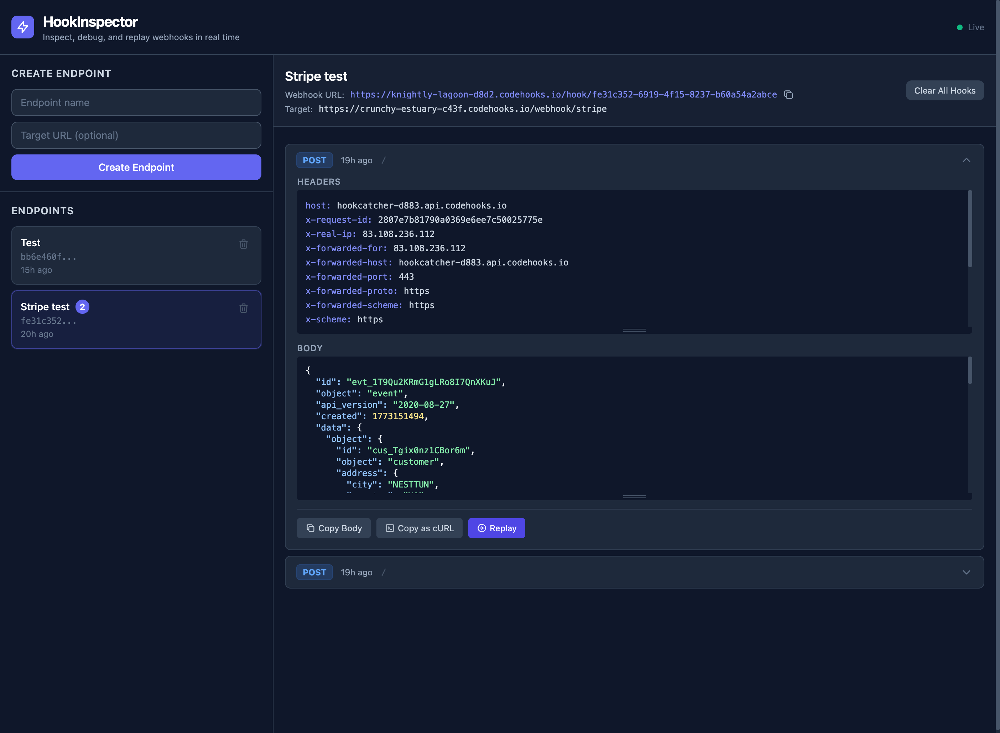

# Webhook Inspector

Catch, inspect, and replay webhooks. A self-hosted alternative to RequestBin built on Codehooks.io.



## Quick Setup

### Option 1: Create a new project with this template (Recommended)

```bash
coho create myinspector --template webhook-inspector
cd myinspector
npm install
coho deploy
```

### Option 2: Install in an existing directory

```bash
mkdir myinspector
cd myinspector
coho install webhook-inspector
npm install
coho deploy
```

## Features

- **Create endpoints** — each gets a unique UUID-based webhook URL
- **Catch all HTTP methods** — GET, POST, PUT, PATCH, DELETE
- **Inspect requests** — headers, body, query params with syntax highlighting
- **Replay webhooks** — forward captured webhooks to a target URL with original headers and body
- **Copy as cURL** — reproduce any webhook with a single command (preserves raw body for signed webhooks)
- **Auto-cleanup** — hooks older than 7 days are deleted automatically
- **Dark mode UI** — single-page app with Tailwind CSS, no build step

## How It Works

1. Create an endpoint (with optional target URL for replay)
2. Send webhooks to `https://YOUR-APP.codehooks.io/hook/<uuid>`
3. Inspect incoming requests in real time (5-second polling)
4. Replay any captured webhook to your target URL

## API Routes

| Method | Route | Description |
|--------|-------|-------------|
| POST | `/api/endpoints` | Create new endpoint |
| GET | `/api/endpoints` | List all endpoints |
| DELETE | `/api/endpoints/:uuid` | Delete endpoint + its hooks |
| ANY | `/hook/:uuid` | Catch incoming webhook |
| GET | `/api/hooks/:uuid` | List hooks for endpoint |
| DELETE | `/api/hooks/:uuid` | Delete all hooks for endpoint |
| POST | `/api/hooks/:id/replay` | Replay hook to target URL |

## Replay

The replay feature forwards the captured webhook to the endpoint's target URL:

- Preserves original headers (strips proxy/hop-by-hop headers)
- Uses raw body bytes for faithful replay (important for signed webhooks like Stripe)
- Supports internal Codehooks-to-Codehooks routing

## Architecture

- **Backend**: Single `index.js` with codehooks-js routes
- **Frontend**: Single `public/index.html` with Tailwind CDN
- **Database**: Two collections — `endpoints` and `hooks`
- **Auth**: None — UUID-based access (suitable for dev/testing)
